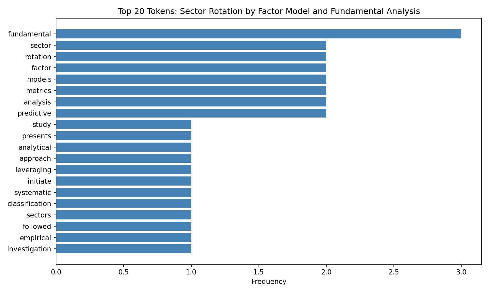
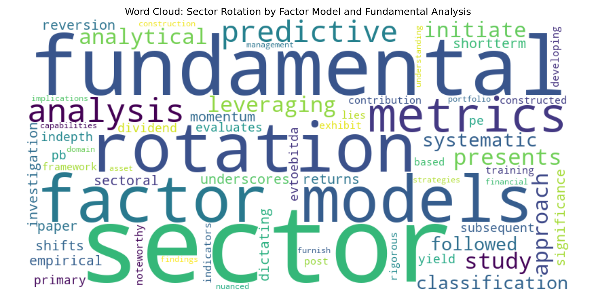

# Web Mining and Applied NLP

This site provides documentation for this project.
Use the navigation to explore module-specific materials.

## How-To Guide

Many instructions are common to all our projects.

See
[⭐ **Workflow: Apply Example**](https://denisecase.github.io/pro-analytics-02/workflow-b-apply-example-project/)
to get these projects running on your machine.

## Project Documentation Pages (docs/)

- **Home** - this documentation landing page
- **NLP Evolution** - a relatively concise discussion of NLP evolution
- **Project Instructions** - instructions specific to this module
- **Glossary** - project terms and concepts

# NLP Web Pipeline Project

## Overview
This project builds a full NLP pipeline to extract, process, and analyze text data from an arXiv research paper.

The pipeline follows the EVTL workflow:
- Extract HTML data from a web source
- Validate structure
- Transform text into analysis-ready format
- Analyze token frequencies and patterns
- Load results into CSV and visualizations

---

## Data Source
The project uses an arXiv research paper as input.
The structure remains consistent while allowing flexibility to analyze different papers.

---

## Key Outputs

### Bar Chart

### Word Cloud

---

## Insights

- The most frequent words reflect the main topic of the research paper.
- Cleaning and tokenization significantly reduce noise.
- Word cloud provides a quick visual summary of key concepts.

---

## Conclusion
This project demonstrates how a structured NLP pipeline can transform raw web data into meaningful insights and visualizations.
